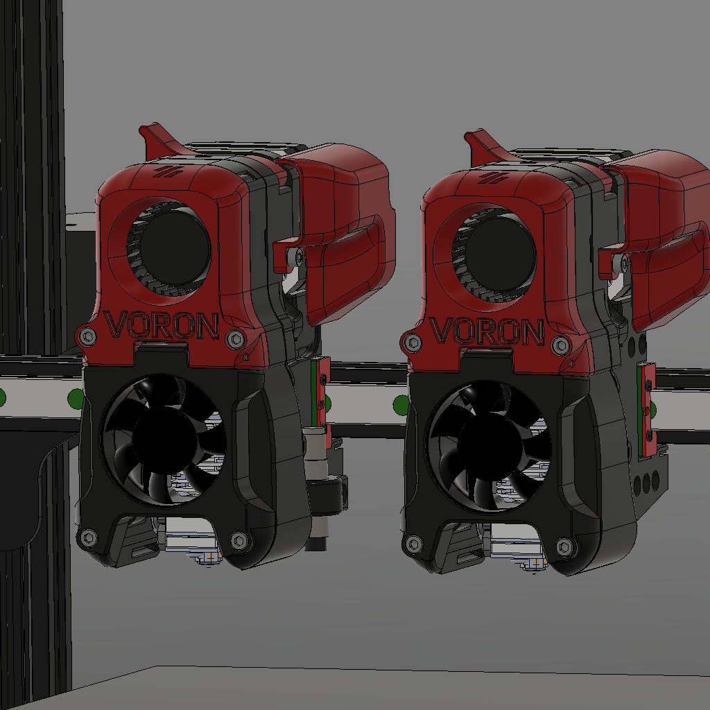

## Afterburner Ender3 + Cable Chain + BL-Touch or PINDA + Raspberry Pi TFT

 
 

If you have any questions feel free to join the [Discord-Server](https://discord.gg/xqpKrxt9FC) 
 

## Still in Progess
This page is currently only used to provide the files and basic instructions. More info and parts for the electronics, Raspi, BL-Touch etc will be added later.  

### Versions
1: PINDA or BL-Touch        |  2: Fan or Raspberry Pi TFT
:-------------------------:|:-------------------------:
  |  
  |  

### Why?
As you can probably guess, I love the Voron design. It makes me so much fun to work with the ideas and great designs that the team around Voron has created. And since the Afterburner not only looks nice but is also quite cheap and reliable, I decided to mount it on the Ender 3. This mod fits all Ender3 and similar machines like CR10 etc. Since the extruder had to come very far forward to be able to install the cable chain, I had a lot of space in the afterburner carriage. Therefore, I decided to integrate the limit switch into the carriage.

### A good Idea?
Definitely yes, if you can print with ABS(+). I first printed the parts out of PETG and I had a lot of problems. Besides that, the extruder is very strong like the normal BMG extruder and just works perfectly. I have been using the extruder continuously for weeks now and I am very happy with it.
If you are from Germany or the EU, please send me a message via Discord and I can print the parts for you.

### Important SAFTY notes
Do not use the original cables in the cable chain! Do not use PVC cables, these will break after some time! I replaced all my cables with silicone cables, so they do not break. You can also use PTFE cables or HELUKABEL, but this is much more expensive. If you are from Germany you can find cheap silicone cables in the online store from Conrad Electronik.

### How to print?
All parts can be printed without support (except x_motor_housing.stl; see STL Folder) and are already in the optimal orientation for printing. All Afterburner parts should be printed out of Abs. I'm using Esun ABS+, this is very easy tp print. But remember that the fumes are toxic, so use an enclosure and an air filter ([BFACH](https://github.com/kevinakasam/BFACH "BFACH")).

### BOM
* #### Rail
  * 1x MGN 12H 300mm
  * 12x M3x8mm (to mount the rail)
  * 12x M3 t-nut (to mount the rail)
  * 1x M5x8mm (to mount the limit block)
  * 1x M5 t-nut (to mount the limit block)
  * 2 Meter GT2 Belt (Glas Fiber reinforced)
* #### Afterburner Carriage Pinda
  * 3x M3x20mm
  * 1x M3x5mm
* #### Afterburner Carriage BL-Touch
  * 3x M3x20mm
  * 1x M3x5mm
  * 5x M3 brass heat insert
  * 5x M3x35mm
* #### PINDA Mout
  * 1x M3 brass heat insert
  * 1x M3x8mm
* #### BL-Touch Mount
  * 2x M3 brass heat insert
  * 2x M3x8mm
* #### Cable Chain
  * 1 Meter 10x11 cable chain (open and closed ine works. I used the open one for better access)
  * 3x M3 brass heat insert (for mounting to the chain anchor)
  * 3x M3x5mm (for mounting to the chain anchor)
* #### X Motor Housing
  * 3x M3x5mm (to mount the x-motor)
  * 1x M3x30mm (to mount the housing)
* #### Afterburner
  * Please use Voron sourcung guide: https://vorondesign.com/sourcing_guide (Click on the Afterburner sheet at the bottom)
  * **I'm using a 23mm nema. If you want to use a 20mm one you have to modify the parts!**
* #### Afterburner 5015 Mod
  * Please check Gregs page: https://github.com/Greg191134/Voron/tree/master/Afterburner%20Optimisation
